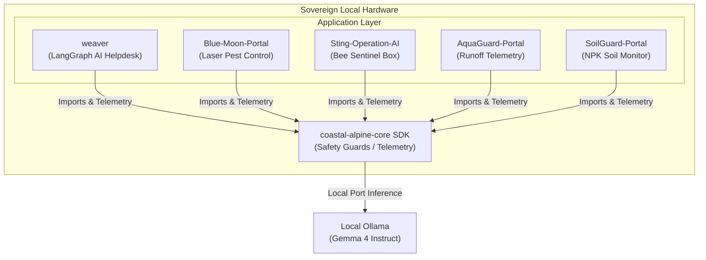

# Coastal Alpine Tech Limited: Kiwi Edge AI Stack

  

Welcome to the official repository landing page for **Coastal Alpine Tech Limited**, headquartered in New Plymouth, Taranaki, New Zealand. We design and deploy offline-native, data-sovereign edge intelligence systems for remote, high-stakes industrial, agricultural, and biosecurity settings across New Zealand.

Our stack operates entirely on-premise (e.g. on Raspberry Pi 5 hardware with NPU acceleration) to maintain customary data rights (Te Mana Raraunga / Māori Data Sovereignty) and guarantee 100% operational uptime in rural catchments facing cloud blackouts.

---

## 🚀 The Kiwi Edge AI Stack Portfolio

| Repository | Role | Core NZ Regulations | Primary Hardware Target |
| :--- | :--- | :--- | :--- |
| [weaver](https://github.com/fivepanelhat/weaver) | Multi-tenant helpdesk & local RAG mesh | Privacy Act 2020, Public Records Act 2005 | RPi 5 (8GB/16GB) |
| [Blue-Moon-Portal](https://github.com/fivepanelhat/Blue-Moon-Portal) | Automated crop lighting & laser target tracking | HSNO Act 1996, HSWA 2015 (Laser safety) | RPi 5 + AI HAT+ |
| [Sting-Operation-AI](https://github.com/fivepanelhat/Sting-Operation-AI) | YOLO wasp & bee classifier beehive sentinel | Biosecurity Act 1993, Animal Welfare Act 1999 | RPi 5 + Hailo-8L |
| [AquaGuard-Portal](https://github.com/fivepanelhat/AquaGuard-Portal) | Water runoff, sediment, & turbidity telemetry | RMA 1991, Horizons One Plan, regional consents | RPi 5 + Camera + Mic |
| [SoilGuard-Portal](https://github.com/fivepanelhat/SoilGuard-Portal) | Soil N-P-K, pH, & moisture crop control | NES-F 2020 (Synthetic N cap), FWFPs | RPi 5 + AI HAT+ |
| [coastal-alpine-core](https://github.com/fivepanelhat/coastal-alpine-core) | Shared SDK (Offline LLM wrapper, safety, telemetry) | - | Python 3.10+ Edge-wide |

---

## 🛠️ Stack Architecture Overview

The following diagram illustrates how the shared core SDK powers data-sovereign telemetry parsing, security screening, and offline reasoning across the different application portals:

---

## 💼 Core Operating Philosophies

1. **Sovereign by Design**: Data generated on NZ *whenua* is processed and stored locally, fully conforming to Te Mana Raraunga principles. We avoid commercial third-party cloud data leakage.
2. **Rural Resilience**: Our systems are engineered to withstand rural connectivity blackouts, executing local multi-modal vision and audio inference without any internet connection.
3. **Regulatory Safety**: Systems actively control actuators (like locking out fertigation lines or disabling class 3B lasers) to automatically prevent regulatory breaches of Regional Council rules.

Developed with pride in **Taranaki, New Zealand** 🇳🇿
