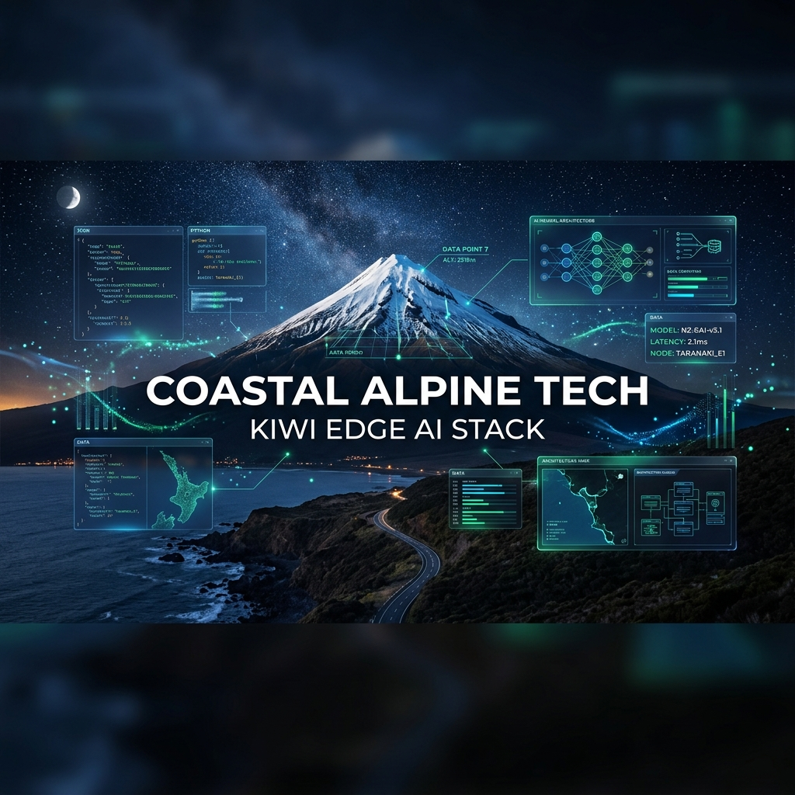
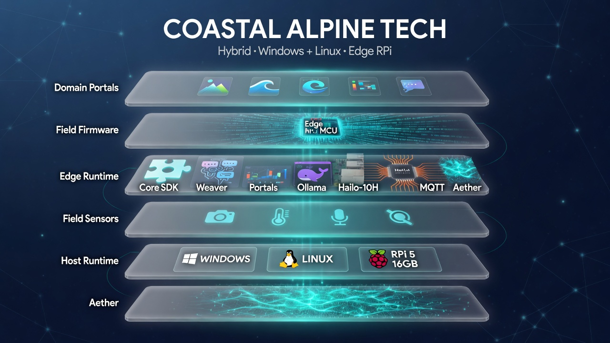
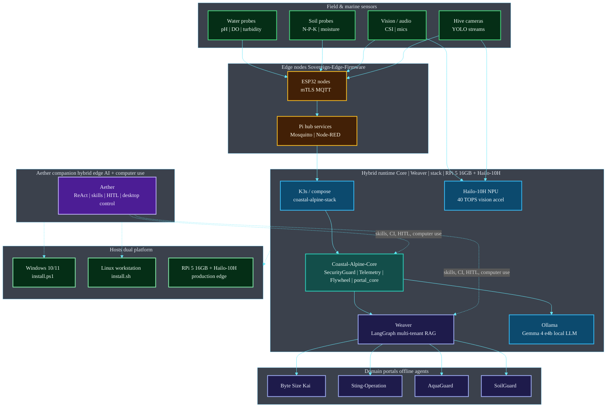

# Coastal Alpine Tech Limited: Kiwi Edge AI Stack

[](./COMPLIANCE.md)
[](./COMPLIANCE.md)
[](./COMPLIANCE.md)
[](./COMPLIANCE.md)
[](./COMPLIANCE.md)
[](./COMPLIANCE_REGIONS.md)
[](./COMPLIANCE_REGIONS.md)
[](./SECURITY.md)
[](./COMPLIANCE.md)


<!-- BEGIN CAT_CONGRUENCE_SNIPPET -->
## Coastal Alpine Tech portfolio

[](https://github.com/fivepanelhat/fivepanelhat)
[](https://github.com/fivepanelhat/fivepanelhat)
[](./.github/agent-fleet/AGENTS.md)
[](https://github.com/fivepanelhat/fivepanelhat)

**Part of the [Kiwi Edge AI Stack](https://github.com/fivepanelhat/fivepanelhat)** | Founder OS: [NZ-Start-Up](https://github.com/fivepanelhat/NZ-Start-Up) | Agent policy: [`.github/agent-fleet/`](./.github/agent-fleet/)

> Sovereign hybrid edge AI for NZ farms and founders - local-first + multi-model, Te Mana Raraunga aligned - collaborating with Venture Taranaki, startups.com investors and Kotahitanga Investment Fund (HITL + cultural advisory for formal approaches).

**See [AI Infrastructure Leadership](./AI_INFRASTRUCTURE_LEADERSHIP.md) for our positioning as New Zealand's leader in sovereign edge AI Infrastructure.**

**Agents inform, draft, prepare, monitor, and remind. Humans advise, sign, file, send, and pay.** 
Anti-hallucination policy: [`.github/agent-fleet/anti-hallucination.md`](./.github/agent-fleet/anti-hallucination.md) | Congruence: [`CAT_CONGRUENCE.md`](./CAT_CONGRUENCE.md)
<!-- END CAT_CONGRUENCE_SNIPPET -->

<!-- BEGIN PRIVACY_SECURITY_GOVERNANCE -->
## Privacy / Security / Governance

Coastal Alpine Tech products treat operational and personal data as **taonga**. Defaults favour **local-first** operation, **purpose-limited** collection, and **Human-in-the-Loop** for high-stakes actions.

### Hard commitments

| Commitment | Statement |
| :--- | :--- |
| **No data sales** | **We do not sell personal information or customer operational data to third parties** for advertising, brokerage, or unrelated commercial exploitation. |
| **NZ Privacy Act 2020** | Collection, use, storage, and disclosure of personal information is designed to operate in accordance with the **Privacy Act 2020** information privacy principles (including IPP awareness and IPP 3A indirect-collection notification where applicable). |
| **Te Mana Raraunga** | Where Māori data or community data interests arise, systems are designed to operate **in accordance with Te Mana Raraunga** principles (including Rangatiratanga, Whakapapa, Whanaungatanga, Kotahitanga, Manaakitanga, Kaitiakitanga) as a sovereignty and stewardship lens — not as a marketing slogan. |
| **NZ AI safety** | AI features follow a **NZ AI safety-aligned** posture: Algorithm Charter spirit (fairness, transparency, human oversight where relevant), digital.govt.nz / responsible AI guidance awareness, no silent model training on private journals without consent, and HITL for high-stakes outcomes. |
| **Security** | No silent exfiltration; owner-controlled credentials; least privilege; SecOps / dependency hygiene on the fleet cadence. |
| **Governance** | Agents **inform, draft, prepare**; humans **advise, sign, file, send, and pay**. |

| Pillar | Commitment |
| :--- | :--- |
| **Privacy** | Local-first / offline-capable where practical; Privacy Act 2020; Te Mana Raraunga spirit; third-party AI only when **opt-in and labelled** |
| **Security** | No silent exfil of tenant or personal data; owner-controlled keys |
| **Governance** | HITL for high-stakes; Te Mana Raraunga spirit; multi-region compliance maps in [`COMPLIANCE_REGIONS.md`](./COMPLIANCE_REGIONS.md) |

**Agents inform, draft, prepare, monitor, and remind. Humans advise, sign, file, send, and pay.**

Fleet policy: [fivepanelhat / Kiwi Edge AI Stack](https://github.com/fivepanelhat/fivepanelhat) · [`COMPLIANCE.md`](./COMPLIANCE.md) · [`COMPLIANCE_REGIONS.md`](./COMPLIANCE_REGIONS.md) · [`SECURITY.md`](./SECURITY.md)
<!-- END PRIVACY_SECURITY_GOVERNANCE -->

## Fleet mandate: Privacy / Security / Governance

Every Coastal Alpine Tech repository is expected to surface **Privacy**, **Security**, and **Governance** in the README and `COMPLIANCE.md` / `SECURITY.md`:

1. **Privacy** — local-first defaults, Privacy Act 2020 awareness, Te Mana Raraunga spirit, opt-in labelled third-party AI
2. **Security** — no silent exfiltration, least privilege, SecOps / red-team cadence on fleet CI
3. **Governance** — HITL for high-stakes; agents draft/prepare only; humans sign, send, file, and pay


<!-- BEGIN PROBLEMS_SOLUTIONS_ECONOMY -->
## Problems we are solving

The **Kiwi Edge AI Stack** exists so Aotearoa can run hybrid edge + multi-model AI for farms, founders, and frontline care **without** defaulting to always-on foreign cloud dependency.

1. **Primary industries locked to cloud SaaS** - Rural latency, outages, and offshore data residency conflict with real operations and Te Mana Raraunga.
2. **Fragmented product landscape** - Growers, EDAs, and whanau face many disconnected tools instead of one coherent stack.
3. **Founder overhead** - Early NZ companies burn time on formation, compliance, and grants with little local digital capacity.
4. **Social navigation fatigue** - Whanau in high-stress pathways face scattered directories and equity gaps.
5. **Shallow "AI employees" hype** - Unconstrained agents create legal and cultural risk; NZ needs hard HITL ceilings.

## Solution we have built

| Layer | Solution (repo) | Role |
| :--- | :--- | :--- |
| **Beachhead agritech** | [Byte Size Kai](https://github.com/fivepanelhat/Byte-Size-Kai) | Lead commercial edge product for crop / Mana Kai intelligence |
| **Beachhead social** | [Front_Line_Whanau](https://github.com/fivepanelhat/Front_Line_Whanau) | National whanau / frontline support platform |
| **Founder OS** | [NZ-Start-Up](https://github.com/fivepanelhat/NZ-Start-Up) | Local founder OS + EDA white-label kit |
| **Edge foundation** | Core, Weaver, Aether, stack, firmware | SDK, orchestration, companion agents, deploy, field nodes |
| **Domain portals** | SoilGuard, AquaGuard, Sting | Soil, water, biosecurity specialists |
| **Privacy utility** | CAT-mail | Privacy-first email assist (parked vs beachheads) |

**Hardware target:** Raspberry Pi 5 (16GB) + Hailo-10H NPU | **Policy:** agents draft/prepare; humans sign/send/pay.

### Local (Taranaki) and national (Aotearoa) economic benefits

Coastal Alpine Tech is a **pre-seed** company engineering in **New Plymouth, Taranaki**, with field context in regional primary industries (including Mana Kai-class / Horowhenua agritech). Benefits are framed as **pathways**, not guaranteed job numbers.

#### Local / regional (Taranaki and rural NZ)

| Pathway | What it creates |
| :--- | :--- |
| **R&D and product HQ** | Engineering, product, and IP ownership in region - counterweight to capital-city-only tech |
| **Field install and support** | RPi / Hailo edge nodes, ESP32 sensors, and pilot support need local technicians and partners |
| **EDA leverage** | Tools that help Venture Taranaki-class programmes onboard more founders without linear staff growth |
| **Contractor network** | Legal, cultural advisory, hardware, and pilot ops spend that stays in NZ |

#### National economy and employment

| Pathway | What it creates |
| :--- | :--- |
| **Primary sector competitiveness** | Better yield, compliance, and biosecurity decisions support NZ's export food economy |
| **Onshore data value** | Farm, whanau, and SME operational data stays under NZ custody (Privacy Act + Te Mana Raraunga) |
| **Founder formation** | Faster, cleaner company setup and RDTI-ready logging keeps more early companies investable **in NZ** |
| **Digital capability outside main centres** | Edge AI skills (vision, MQTT, local LLM) transferable across regions |
| **Quality of work** | Human-in-the-loop design preserves skilled human roles in advice, compliance, and care |

#### How this product contributes

See **Solution we have built** above. Cross-portfolio map: [Kiwi Edge AI Stack](https://github.com/fivepanelhat/fivepanelhat) | employment detail: [NZ-Start-Up investor pack](https://github.com/fivepanelhat/NZ-Start-Up/blob/main/docs/INVESTOR_RD_AND_MARKET_REFERENCE.md).

#### Portfolio employment map (pathways)

| Path | Sequence | Employment / economy effect |
| :--- | :--- | :--- |
| **Founder -> fleet** | NZ-Start-Up -> RDTI logs -> board packs | More investable founders formed in Taranaki / regions |
| **EDA -> region** | PowerUp-class white-label -> cohort reports | EDA capacity without linear headcount |
| **Founder -> field** | Agritech founder -> Byte Size Kai / SoilGuard pilot | Farm productivity + local install jobs |
| **Trust -> enterprise** | HITL + compliance mapping -> procurement-ready narrative | Public / enterprise readiness without fake autonomy |
| **Social care** | Front_Line_Whanau (cultural HITL) | Social licence and equity impact (separate GTM from agritech pitch) |
<!-- END PROBLEMS_SOLUTIONS_ECONOMY -->

## Technical Moat

Coastal Alpine Tech’s defensibility comes from the tight integration of six capabilities that are rarely combined at the edge:

- **Edge orchestration** — LangGraph multi-tenant mesh (Weaver) that keeps every tenant’s knowledge and state strictly local.
- **Sovereign architecture** — Default-offline, Te Mana Raraunga-aligned paths. Data generated on whenua stays on whenua unless the owner explicitly moves it.
- **Hardware optimisation** — Canonical target of Raspberry Pi 5 16GB + Hailo-10H with energy-aware telemetry (joules, tokens/s) built into every portal path.
- **AI deployment tooling** — Shared Core SDK + dual-platform installers + Aether companion so the same stack runs on Windows/Linux workstations and production edge nodes.
- **Proprietary local datasets** — Continuous DataFlywheel that records trajectories, human feedback, and hardware outcomes on-device, then curates golden sets under owner control. Nothing leaves the node by default.
- **Inference optimisation** — Hardware-aware measurement and adaptive local paths (Ollama + optional Hailo acceleration) tuned for sub-10 W rural nodes rather than cloud GPUs.

These are not separate features. They form a single closed loop: sensors → local inference → trajectory capture → human-in-the-loop correction → improved local models → better decisions — all while remaining offline-capable and sovereignty-compliant.

The result is a system that becomes more valuable the longer it runs on a given farm or site, without requiring continuous cloud connectivity or data export.

## Enterprise Readiness

Coastal Alpine Tech is pre-seed. The following artefacts exist so that enterprise buyers, partners, and investors can see the design intent, current controls, and staged path forward — without over-claiming certification or maturity that does not yet exist.

| Artefact | Purpose |
|----------|---------|
| **[GOVERNANCE.md](./GOVERNANCE.md)** | Decision rights, HITL ceiling, roles, Cultural Advisory interface, escalation |
| **[Security & Compliance Roadmap](./.github/compliance/SECURITY_ROADMAP.md)** | Phased path: current state → first pilot → seed readiness |
| **[Threat Model](./.github/compliance/THREAT_MODEL.md)** | STRIDE-oriented view of the edge + multi-tenant + local-LLM attack surface |
| **[NZ AI Compliance + SOC 2 Framework](./.github/compliance/nz-ai-compliance-soc2/)** | Privacy Act, Te Mana Raraunga, SOC 2 control matrix, incident playbook, audit checklist |
| **Architecture diagrams** | Target architecture (Mermaid + images) in this README and in Core / Weaver / Aether / stack |

**Status (July 2026):** Working technical controls (SecurityGuard, DataFlywheel, tenant isolation design, SecOps workflows) + comprehensive design-target documentation. External audit and formal attestation are future phases gated on pilots and commercial traction.

## R&D Artefacts (2025)

Citation indexes acknowledging Coastal Alpine Tech research and development from organisational Drive materials. These are **design-intent / lineage documents**, not certifications or audited valuations. No personal data is published.

| Artefact | Period | Themes |
| --- | --- | --- |
| **[ARTEFACT-2025-08](./docs/artefacts/ARTEFACT-2025-08.md)** | August 2025 | AgriTech, MicrogreensDAO, Web3, **Sui**, RWA **tokenisation** |
| **[ARTEFACT-2025-11-12](./docs/artefacts/ARTEFACT-2025-11-12.md)** | Nov–Dec 2025 | V4 strategy, **Gold / Diamond / Platinum Edge**, **edge** compute (DGX Spark), multi-vertical blueprints |

Index: [`docs/artefacts/README.md`](./docs/artefacts/README.md)

**Fleet mirrors:** also published under `docs/artefacts/` in Core, stack, Aether, Weaver, Byte-Size-Kai, Front_Line_Whanau, scaffylads, and NZ-Start-Up.

## Commercial Positioning

Technology is currently ahead of commercial packaging. The commercial logic is documented so investors and partners can see customer segments, packaging shape, recurring revenue intent, GTM sequence, and sales funnel — without invented ARR or public dollar prices.

| Artefact | Purpose |
|----------|---------|
| **[Commercial Positioning](./.github/funding/COMMERCIAL_POSITIONING.md)** | Customer segments, packaging tiers (no public $), recurring model, GTM, funnel |
| **[Investor Matrix](./.github/funding/INVESTOR_MATRIX.md)** | What different capital types optimise for |
| **[Funding Eligibility Matrix](./.github/funding/FUNDING_ELIGIBILITY_MATRIX.md)** | Likelihood scores and gap-closure path |

**Pricing posture:** Specific dollar figures are not published. Commercial terms are set per pilot or partnership and refined with real willingness-to-pay data.

[](https://github.com/fivepanelhat)
[](./LICENSE)
[](https://www.python.org)

[](https://github.com/fivepanelhat/fivepanelhat)
[](https://github.com/fivepanelhat/fivepanelhat)
[](https://github.com/fivepanelhat/fivepanelhat)
[](https://github.com/fivepanelhat/fivepanelhat)

[](https://anthropic.com)
[](https://gemini.google.com)
[](https://openai.com)
[](https://x.ai)

[](https://ollama.com)
[](https://github.com/fivepanelhat/fivepanelhat)
[](https://github.com/fivepanelhat/coastal-alpine-stack)
[](https://github.com/fivepanelhat/fivepanelhat)

[](https://github.com/fivepanelhat/fivepanelhat/actions/workflows/ci-scan.yml)
[](https://github.com/fivepanelhat/fivepanelhat/actions/workflows/secops.yml)
[](https://github.com/fivepanelhat/fivepanelhat/actions/workflows/redteam.yml)
[](https://github.com/fivepanelhat/fivepanelhat/security/dependabot)



**Coastal Alpine Tech Limited** pre-seed startup, New Plymouth, Taranaki, Aotearoa New Zealand.

We are building offline-native, data-sovereign edge intelligence for remote industrial, agricultural, and biosecurity settings across Aotearoa. This org profile maps our **Kiwi Edge AI Stack** early-stage product architecture and open engineering work, **not** a claim of large-scale commercial deployment or raised Series capital.

Our stack is **hybridised** across **Coastal-Alpine-Core**, **Weaver**, **Aether**, and **coastal-alpine-stack**: develop on **Windows or Linux**; target production edge on the **canonical node** **Raspberry Pi 5 (16GB)** with **Hailo-10H NPU** (40 TOPS AI Accelerator / AI HAT+ 2) to support customary data rights (Te Mana Raraunga / Maori Data Sovereignty) and offline operation in rural catchments facing cloud blackouts.

---

## Compliance at a glance

A compact view of the governance work now living in this org profile (full framework under [`.github/compliance/`](.github/compliance/nz-ai-compliance-soc2/)):

 | Pillar | Focus |
 | :--- | :--- |
 | **Privacy Act 2020** | IPP 111 mapping, DSAR pathways, retention |
 | **Te Mana Raraunga** | Maori data sovereignty + OCAP-aligned control |
 | **SOC 2 Type II** | CC / A / S / P controls, 225-item matrix |
 | **MBIE Responsible AI** | Safety-by-design, explainability, HITL gates |
 | **NZ Algorithm Charter** | Transparent decisions, human appeal |

**Status (pre-seed):** Compliance **framework documents** are in-repo as design targets **not** an external SOC 2 Type II attestation. Implementation is early-stage.
**Local docs:** [SKILL.md](.github/compliance/nz-ai-compliance-soc2/SKILL.md) | [Implementation guide](.github/compliance/nz-ai-compliance-soc2/README.md) | [Audit checklist](.github/compliance/nz-ai-compliance-soc2/references/COMPLIANCE_AUDIT_CHECKLIST.md) | [Security Roadmap](.github/compliance/SECURITY_ROADMAP.md) | [Threat Model](.github/compliance/THREAT_MODEL.md)

---

## Funding system (grants + tracker)

Org home for **Maori AI | deeptech | agritech | sovereign edge** funding discovery and applications (HITL required):

 | Resource | Path |
 | :--- | :--- |
 | **Funding index** | [`.github/funding/README.md`](.github/funding/README.md) |
 | **Guide** | [`.github/funding/FUNDING_GUIDE.md`](.github/funding/FUNDING_GUIDE.md) |
 | **Tracker** | [`.github/funding/FUNDING_TRACKER.md`](.github/funding/FUNDING_TRACKER.md) | [tracker.csv](.github/funding/tracker.csv) |
 | **Grants Agent skill** | [`.github/funding/grants-agent/SKILL.md`](.github/funding/grants-agent/SKILL.md) |
 | **Knowledge base** | [`.github/funding/knowledge-base/`](.github/funding/knowledge-base/) |
 | **Fit scorer** | `python .github/funding/scripts/score_fit.py --project "..."` |
 | **Eligibility matrix** | [`.github/funding/FUNDING_ELIGIBILITY_MATRIX.md`](.github/funding/FUNDING_ELIGIBILITY_MATRIX.md) likelihood of grants/seed by narrative, TAM, prerequisites |
 | **Investor matrix** | [`.github/funding/INVESTOR_MATRIX.md`](.github/funding/INVESTOR_MATRIX.md) what investors & founders want (Halter / Sharesies / Cursor comps) |
 | **Commercial positioning** | [`.github/funding/COMMERCIAL_POSITIONING.md`](.github/funding/COMMERCIAL_POSITIONING.md) segments, packaging, GTM, funnel (no public $) |
 | **Roadmap / todos** | [`.github/funding/ROADMAP_TIMELINE.md`](.github/funding/ROADMAP_TIMELINE.md) timeline to attain each grant/seed path |
 | **Install matrix** | [`.github/funding/INSTALL_MATRIX.md`](.github/funding/INSTALL_MATRIX.md) Windows + Linux installers, smoke status |

### Open / near-term priorities (research snapshot 2026-07-13)

 | Priority | Fund | Status | Indicative value |
 | :--- | :--- | :--- | :--- |
 | **P0** | [New to R&D Grant](https://www.business.govt.nz/tax-and-money/innovation-funding/new-to-r-and-d-grant) (MBIE) | **OPEN** | 40% co-fund up to **$400k** |
 | **P0** | [Maori Development Fund](https://www.tpk.govt.nz/nga-putea-me-nga-ratonga/maori-development-fund) (TPK) | **OPEN** (rolling; regional office first) | Proposal-based | fund **$40.21m p.a.** |
 | **P0** | [Primary Sector Growth Fund](https://www.mpi.govt.nz/funding-rural-support/primary-sector-growth-fund) (MPI) | **OPEN** | Co-investment (replaces SFF Futures) |
 | **P1** | R&D Experience Grant | Opens **13 Jul 2026** | Student ~10 weeks |
 | **P1** | R&D Career Grant | Opens **31 Aug 2026** | Up to $30k / $35k (6 months) |
 | **P1** | [RDTI](https://www.rdti.govt.nz/) | Ongoing | **15%** tax credit |
 | **P2** | NZIAT AI Research Platform | Partner / watch | ~**$70m** / 7 years (platform) |

Re-verify every status on the funder site before applying. Agent drafts are **not** submissions.

---

## Canonical hardware target

 | Component | Specification |
 | :--- | :--- |
 | Compute | **Raspberry Pi 5 16GB RAM** |
 | NPU | **Hailo-10H** (40 TOPS) via Raspberry Pi **AI Accelerator / AI HAT+ 2** |
 | OS (edge) | Raspberry Pi OS (64-bit) |
 | Dev hosts | **Windows 10/11** | **Linux** (Ubuntu/Debian/RPi OS) | macOS optional |
 | Local LLM | Ollama + Gemma 4 (`gemma4:e4b`) on-device |

All Coastal Alpine edge repositories document this same target. Do not mix Hailo-8 / Hailo-10L / 8GB SKUs in product docs.

---

## Focus wedges (90-day)

| Priority | Wedge | Canonical repo | Notes |
| :--- | :--- | :--- | :--- |
| **P0** | **Byte Size Kai** (agritech) | [Byte-Size-Kai](https://github.com/fivepanelhat/Byte-Size-Kai) + Core | Commercial hardware pilot path |
| **P0** | **Front Line Whanau** (social) | [Front_Line_Whanau](https://github.com/fivepanelhat/Front_Line_Whanau) | Live: front-line-whanau.vercel.app |
| Supporting | Stack foundation | Core, Weaver, Aether, stack, firmware | Shared SDK / deploy |
| Supporting | Sister portals | Soil / Aqua / Sting | Background until wedge needs them |
| Parked | Founder tools | CAT-mail, NZ-Start-Up | Not the sales narrative |
| **Archived** | Whanau hub scaffold | [whanau-preterm-support-hub](https://github.com/fivepanelhat/whanau-preterm-support-hub) | **Merged into Front_Line_Whanau** (2026-07-16) |

## License matrix (SPDX)

| Repository | License | Notes |
| :--- | :--- | :--- |
| Coastal-Alpine-Core, Weaver, coastal-alpine-stack, portals, firmware | Proprietary (CAT) | Commercial edge stack |
| Byte-Size-Kai | Proprietary (CAT) | Lead agritech product |
| Front_Line_Whanau | Proprietary (CAT) | National social platform |
| Aether | Proprietary (CAT) | Internal companion |
| scaffylads | Proprietary (CAT) | Scaffolding work journal |
| CAT-mail | Proprietary (CAT) | Privacy-first email agent |
| NZ-Start-Up | Proprietary (CAT) | Founder OS (dual-licence, Track A default) |
| fivepanelhat (profile) | Proprietary docs | Portfolio landing |

The entire portfolio is standardised on the **Coastal Alpine Tech proprietary
licence**. Front_Line_Whanau, Aether (both previously Apache-2.0) and CAT-mail
(previously MIT) were relicensed to proprietary; this governs each repo going
forward, and does not affect versions already distributed under the earlier
open licences.

Each repo ships a root `LICENSE` file. Prefer SPDX in GitHub repo settings so the UI does not show `NOASSERTION`.

## The Kiwi Edge AI Stack Portfolio

 | Repository | Role | Platforms | Core NZ Regulations | Primary hardware |
 | :--- | :--- | :--- | :--- | :--- |
 | [Coastal-Alpine-Core](https://github.com/fivepanelhat/Coastal-Alpine-Core) | Shared SDK (guards, telemetry, Ollama, portal_core, flywheel) | **Windows | Linux | RPi** | Te Mana Raraunga 2018 | RPi 5 16GB + Hailo-10H |
 | [Weaver](https://github.com/fivepanelhat/Weaver) | Multi-tenant helpdesk & local RAG mesh | **Windows | Linux | RPi** | Privacy Act 2020, Public Records Act 2005 | RPi 5 16GB + Hailo-10H |
 | [Aether](https://github.com/fivepanelhat/Aether) | Sovereign agentic companion + computer use | **Windows | Linux | macOS** | Te Mana Raraunga 2018 | Dev workstation / edge companion |
 | [coastal-alpine-stack](https://github.com/fivepanelhat/coastal-alpine-stack) | Full stack compose / K3s monorepo | **Windows | Linux | RPi** | Te Mana Raraunga 2018 | RPi 5 16GB + Hailo-10H |
 | [**Byte Size Kai**](https://github.com/fivepanelhat/Byte-Size-Kai) (`Byte-Size-Kai`) | **Lead agritech product** - multi-modal edge AI for microgreens / Mana Kai | Edge Linux | Biosecurity Act 1993, HSNO Act 1996, Food Act 2014 | RPi 5 16GB + Hailo-10H |
 | [Sting-Operation-AI](https://github.com/fivepanelhat/Sting-Operation-AI) | YOLO wasp & bee classifier beehive sentinel | Edge Linux + Hailo | Biosecurity Act 1993, Animal Welfare Act 1999 | RPi 5 16GB + Hailo-10H |
 | [AquaGuard-Portal](https://github.com/fivepanelhat/AquaGuard-Portal) | Water runoff, sediment, & turbidity telemetry | Edge Linux | RMA 1991, Horizons One Plan, regional consents | RPi 5 16GB + Hailo-10H |
 | [SoilGuard-Portal](https://github.com/fivepanelhat/SoilGuard-Portal) | Soil N-P-K, pH, & moisture crop control | Edge Linux | NES-F 2020 (Synthetic N cap), FWFPs | RPi 5 16GB + Hailo-10H |
 | [Sovereign-Edge-Firmware](https://github.com/fivepanelhat/Sovereign-Edge-Firmware) | ESP32 sensor firmware + edge hub | Field + Pi hub | Te Mana Raraunga 2018 | RPi 5 16GB hub + ESP32 nodes |
 | [Front_Line_Whanau](https://github.com/fivepanelhat/Front_Line_Whanau) | **Canonical** national whanau / preterm support platform | Web / PWA / Tauri | Privacy Act 2020, Te Tiriti | Vercel + optional desktop |
 | ~~whanau-preterm-support-hub~~ | **ARCHIVED** scaffold - do not contribute | - | - | Redirect -> Front_Line_Whanau |

### Featured edge product: Byte Size Kai (agritech beachhead)

**Byte Size Kai** is the forefront agritech offering on this stack - sovereign multi-modal crop intelligence for microgreens and Mana Kai-class growers (Horowhenua field context / Taranaki engineering).

| | |
|--|--|
| **Product brand** | Byte Size Kai |
| **Repository (technical / CI path)** | [Byte-Size-Kai](https://github.com/fivepanelhat/Byte-Size-Kai) - keep clone URLs as-is |
| **Stack role** | Domain portal on Coastal-Alpine-Core + Hailo vision + local Ollama |
| **Sister portals (background)** | SoilGuard, AquaGuard, Sting-Operation |
| **Problems (summary)** | Rural cloud blackouts; unstructured sensors; fragmented farm context; compliance pressure; data sovereignty on whenua |
| **Solution (summary)** | Multi-modal edge portal on RPi 5 16GB + Hailo-10H, Core SDK, ESP32 firmware, HITL actuation |
| **Economy / jobs** | Taranaki R&D HQ, field install/support pathways, primary-sector productivity, onshore data value - see [Byte Size Kai README](https://github.com/fivepanelhat/Byte-Size-Kai#problems-we-are-solving) |

### Featured social product: Front Line Whanau

| | |
|--|--|
| **Product** | [Front_Line_Whanau](https://github.com/fivepanelhat/Front_Line_Whanau) - national whanau / frontline support platform |
| **Problems (summary)** | Fragmented support, NICU information overload, role mismatch, equity gaps, sensitive data risk |
| **Solution (summary)** | Dual portals, national directory, self-service uploads, privacy-first vault, AI draft/prepare only |
| **Economy / jobs** | Frontline capacity, NGO efficiency, regional equity, care-sector digital skills - not clinician replacement |

### Foundation roles (CAT design targets)

CAT Gold / Platinum / Diamond labels are **internal design maturity targets** for a pre-seed company not third-party certifications or claims of enterprise production fleets.

 | Repo | Layer | Design focus |
 | :--- | :--- | :--- |
 | **Weaver** | Orchestration + multi-tenant RAG | HITL, tenant isolation |
 | **Aether** | Agentic companion + computer use | Explainability, fairness, skills |
 | **Coastal-Alpine-Core** | Edge SDK + security primitives | Encryption, device posture |
 | **coastal-alpine-stack** | Deploy / remediate / compose | Fail-closed auth patterns, compose/K3s |

---

## Stack Architecture Overview

End-to-end **target** data path on a sovereign edge node, hybridised with the **Aether** companion. Design intent: sensors and actuators stay on-farm; inference and orchestration stay local. **Develop on Windows or Linux; target deploy on RPi 5.**

> **Diagrams:** Architecture images and Mermaid maps describe the **target product architecture** for this pre-seed stack. They are engineering design maps not claims of large-scale commercial fleet deployment.



### System layers (readable map same target layers as the image)



 | Layer | What runs | Why it matters |
 | :--- | :--- | :--- |
 | **Sensors** | Probes, cameras, audio | Capture stays local to whenua / farm |
 | **Firmware** | ESP32 + mTLS MQTT | Hardened field devices, no cloud telemetry bus |
 | **Hybrid runtime** | Core + Weaver + stack + Ollama + Hailo | Shared SDK, multi-tenant routing, offline inference |
 | **Portals** | Domain agents | **Byte Size Kai** (agritech lead), biosecurity, water, soil |
 | **Aether** | Companion + computer use | HITL, skills, remediation, desktop control (Win/Linux) |
 | **Hosts** | Windows | Linux | RPi 5 | Same hybrid packages; dual-platform installers |

---

## Install Windows + Linux

The hybrid foundation repos ship **one-line installers** for both platforms. Production edge remains **RPi 5 (Linux)**; Windows and Linux workstations are first-class for development.

### Prerequisites

 | | Linux (Ubuntu / Debian / RPi OS) | Windows 10/11 |
 | :--- | :--- | :--- |
 | **Python** | 3.10+ (`python3`, `python3-venv`, `python3-pip`) | 3.10+ from [python.org](https://www.python.org/downloads/) **Add to PATH** |
 | **Git** | `sudo apt-get install -y git` | [Git for Windows](https://git-scm.com/) |
 | **Build tools** | `sudo apt-get install -y build-essential python3-dev` | Usually not required for pure Python |
 | **Ollama** | [ollama.com](https://ollama.com) install script | [Windows installer](https://ollama.com/download/windows) |
 | **PowerShell** | | 5.1+ or 7+; if scripts blocked: `Set-ExecutionPolicy -Scope CurrentUser RemoteSigned` |
 | **Docker** (optional) | `docker.io` / compose for stack services | [Docker Desktop](https://www.docker.com/products/docker-desktop/) |

```bash
# Linux system packages (Debian/Ubuntu/RPi OS)
sudo apt-get update
sudo apt-get install -y python3 python3-dev python3-venv python3-pip git build-essential
```

### One-line installers

#### Coastal-Alpine-Core (shared SDK)

<details open>
<summary><strong>Linux / macOS</strong></summary>

```bash
curl -fsSL https://raw.githubusercontent.com/fivepanelhat/Coastal-Alpine-Core/main/install.sh | bash
```

</details>

<details>
<summary><strong>Windows (PowerShell)</strong></summary>

```powershell
irm https://raw.githubusercontent.com/fivepanelhat/Coastal-Alpine-Core/main/install.ps1 | iex
```

</details>

#### Weaver (multi-tenant orchestration)

<details open>
<summary><strong>Linux / macOS</strong></summary>

```bash
curl -fsSL https://raw.githubusercontent.com/fivepanelhat/Weaver/main/install.sh | bash
# or from a clone: python3 bootstrap.py
```

</details>

<details>
<summary><strong>Windows (PowerShell)</strong></summary>

```powershell
irm https://raw.githubusercontent.com/fivepanelhat/Weaver/main/install.ps1 | iex
# or from a clone: python bootstrap.py
```

</details>

#### Aether (agentic companion + computer use)

<details open>
<summary><strong>Linux / macOS</strong></summary>

```bash
curl -fsSL https://raw.githubusercontent.com/fivepanelhat/Aether/main/install.sh | bash
aether doctor
```

</details>

<details>
<summary><strong>Windows (PowerShell)</strong></summary>

```powershell
irm https://raw.githubusercontent.com/fivepanelhat/Aether/main/install.ps1 | iex
aether doctor
```

</details>

#### coastal-alpine-stack (full monorepo)

<details open>
<summary><strong>Linux / macOS</strong></summary>

```bash
curl -fsSL https://raw.githubusercontent.com/fivepanelhat/coastal-alpine-stack/main/install.sh | bash
```

</details>

<details>
<summary><strong>Windows (PowerShell)</strong></summary>

```powershell
irm https://raw.githubusercontent.com/fivepanelhat/coastal-alpine-stack/main/install.ps1 | iex
```

</details>

### Local models

```bash
ollama pull gemma4:e4b # Weaver / portals / edge
ollama pull qwen2.5-coder:7b # Aether text
ollama pull qwen2.5-vl:7b # Aether computer-use vision
```

### Quick reference

 | Repo | Linux | Windows | Docs |
 | :--- | :--- | :--- | :--- |
 | **Core** | `install.sh` | `install.ps1` | [README](https://github.com/fivepanelhat/Coastal-Alpine-Core#installation) | [DEVELOPER_SETUP](https://github.com/fivepanelhat/Coastal-Alpine-Core/blob/main/DEVELOPER_SETUP.md) |
 | **Weaver** | `install.sh` | `bootstrap.py` | `install.ps1` | `bootstrap.py` | [setup.md](https://github.com/fivepanelhat/Weaver/blob/main/setup.md) | [installation.md](https://github.com/fivepanelhat/Weaver/blob/main/installation.md) |
 | **Aether** | `install.sh` | `install.ps1` | [README](https://github.com/fivepanelhat/Aether#download--install-terminal-cross-platform) | [GETTING_STARTED](https://github.com/fivepanelhat/Aether/blob/main/docs/GETTING_STARTED.md) |
 | **Stack** | `install.sh` | `install.ps1` | [README](https://github.com/fivepanelhat/coastal-alpine-stack#getting-started-windows--linux) | [ARCHITECTURE](https://github.com/fivepanelhat/coastal-alpine-stack/blob/main/ARCHITECTURE.md) |

---

## Core Operating Philosophies

1. **Sovereign by Design**: Data generated on NZ *whenua* is processed and stored locally, fully conforming to Te Mana Raraunga principles. We avoid commercial third-party cloud data leakage.
2. **Rural Resilience**: Our systems are engineered to withstand rural connectivity blackouts, executing local multi-modal vision and audio inference without any internet connection.
3. **Regulatory Safety**: Domain agents are **designed** to support actuator lockouts (e.g. fertigation lines) so operators can reduce risk of Regional Council rule breaches field validation is part of the pre-seed roadmap.
4. **Cross-platform hybrid**: Foundation packages target **Windows and Linux** for development; intended production edge is RPi 5 + Hailo-10H.
5. **HITL by default**: High-risk agent actions and capital/compliance decisions require human approval no silent autonomous implementation of governance changes.

Developed with pride in **Taranaki, New Zealand**.

---

## Governance & capital (summary)

See the full **[GOVERNANCE.md](./GOVERNANCE.md)** for decision rights, roles, HITL policy, and escalation.

### CAT Architectural Standards (design targets)

Internal maturity model **not** external audit grades:

- **Diamond:** security, observability, and deployment hardening goals
- **Platinum:** AI continuous improvement + data flywheel goals
- **Gold:** workflow-native design with transparent HITL gates

### Kotahitanga investment principles

**Kotahitanga** (collective unity) guides capital allocation for sovereign AI and indigenous data infrastructure:

 | Guardrail | Rule of thumb |
 | :--- | :--- |
 | **OCAP alignment** | Ownership, Control, Access, Possession data stays in Aotearoa |
 | **Compliance baseline (internal goals)** | Diamond 95% | Platinum 85% | Gold 80% on the 225-point checklist |
 | **Remediation** | 90% full release | 70-89% escrow | <70% freeze |
 | **HITL capital gates** | Large allocations and Maori-data decisions need human / Cultural Advisory Board sign-off |

Full reference set on this repo:

 | Doc | Path |
 | :--- | :--- |
 | Master skill | [`.github/compliance/nz-ai-compliance-soc2/SKILL.md`](.github/compliance/nz-ai-compliance-soc2/SKILL.md) |
 | Privacy Act mapping | [references/NZ_PRIVACY_ACT_2020_MAPPING.md](.github/compliance/nz-ai-compliance-soc2/references/NZ_PRIVACY_ACT_2020_MAPPING.md) |
 | SOC 2 matrix | [references/SOC2_CONTROL_MATRIX.md](.github/compliance/nz-ai-compliance-soc2/references/SOC2_CONTROL_MATRIX.md) |
 | Te Mana Raraunga | [references/TE_MANA_RARAUNGA_PRINCIPLES.md](.github/compliance/nz-ai-compliance-soc2/references/TE_MANA_RARAUNGA_PRINCIPLES.md) |
 | Incident playbook | [references/INCIDENT_RESPONSE_PLAYBOOK.md](.github/compliance/nz-ai-compliance-soc2/references/INCIDENT_RESPONSE_PLAYBOOK.md) |
 | Audit checklist | [references/COMPLIANCE_AUDIT_CHECKLIST.md](.github/compliance/nz-ai-compliance-soc2/references/COMPLIANCE_AUDIT_CHECKLIST.md) |
 | Security Roadmap | [SECURITY_ROADMAP.md](.github/compliance/SECURITY_ROADMAP.md) |
 | Threat Model | [THREAT_MODEL.md](.github/compliance/THREAT_MODEL.md) |
 | Commercial Positioning | [COMMERCIAL_POSITIONING.md](.github/funding/COMMERCIAL_POSITIONING.md) |

### Key metrics (aspirational targets for a maturing product not current SLAs)

 | Metric | Target |
 | :--- | :--- |
 | Availability SLO | 99.5% monthly |
 | Audit log retention | 18 months (immutable) |
 | DSAR response | 20 working days |
 | Breach notification | 72 hours (Privacy Commissioner) |
 | Backup RTO / RPO | 4 h / 1 h |
 | Incident P0 response | 15 minutes |

---

## Recent stack updates

### 2026-07-17 AI Infrastructure Leadership + Hardening

 | Area | What shipped |
 | :--- | :--- |
 | **AI_INFRASTRUCTURE_LEADERSHIP.md** | New prominent doc positioning CAT as NZ sovereign AI Infrastructure leader; integrates aether-nz-ai-safety hardening, risk tiering, skills extensibility, grounded claims | 
 | **README update** | Added prominent link to new leadership doc in portfolio header |

### 2026-07-16 Commercial Positioning + pricing hygiene

 | Area | What shipped |
 | :--- | :--- |
 | **Commercial Positioning** | Customer segments, packaging logic, recurring model, GTM, funnel (no public dollar prices) |
 | **NZ-Start-Up pricing cleanup** | Removed public NZ$ figures from white-label and sales one-pager; tiers retained |
 | **README linking** | Commercial Positioning section + funding table entry |

### 2026-07-16 Enterprise Readiness artefacts

 | Area | What shipped |
 | :--- | :--- |
 | **GOVERNANCE.md** | Decision rights, HITL ceiling, roles, Cultural Advisory interface |
 | **Security & Compliance Roadmap** | Phased, stage-honest path to pilot and seed readiness |
 | **Threat Model** | STRIDE-oriented view of the actual edge attack surface |
 | **README linking** | Enterprise Readiness section for discoverability |

### 2026-07-13 authenticity + pre-seed positioning

 | Area | What shipped |
 | :--- | :--- |
 | **Company stage** | Coastal Alpine Tech Limited stated as **pre-seed startup** |
 | **Claims hygiene** | Softened enterprise/SLA overclaims; diagrams labelled as **target architecture** |
 | **Capital fiction** | Public materials avoid role-play funded-project narratives |

### 2026-07-13 funding system scaffold

 | Area | What shipped |
 | :--- | :--- |
 | **Funding guide + tracker** | Open NZ grants for Maori AI / deeptech / agritech / sovereign edge (MBIE, TPK, MPI, RDTI, NZIAT) |
 | **Grants agent** | Skill + fit matrix + HITL checklist under `.github/funding/grants-agent/` |
 | **Knowledge base** | Extracted CAT standards + NZ compliance digests for proposal drafting |
 | **Fit scorer** | `scripts/score_fit.py` against `tracker.csv` |

### 2026-07-12 front page hybrid + compliance blend

 | Area | What shipped |
 | :--- | :--- |
 | **Landing page** | Restored product portfolio, architecture, dual-platform install from pre-rewrite front page |
 | **Compliance mix** | Kept NZ AI / SOC 2 / Kotahitanga highlights with **local** doc links (no broken branch paths) |
 | **Visuals** | Ultra liquid glass morphism hero + architecture overview refresh |

### 2026-07-12 hybridise + dual-platform install

 | Area | What shipped |
 | :--- | :--- |
 | **Hybrid foundation** | Core | Weaver | Aether | stack diagrams and docs aligned |
 | **Installers** | `install.sh` + `install.ps1` on Core, Weaver, Aether, coastal-alpine-stack |
 | **Core pin** | Consumers document **@v0.5.4** tagged releases |

### 2026-07-11 harden, document, productise

 | Area | What shipped |
 | :--- | :--- |
 | **Coastal-Alpine-Core** | **v0.5.3** edge SDK optimisations; **v0.5.4** expanded SecurityGuard patterns |
 | **Security (org-wide)** | Least-privilege Actions, Dependabot, SECURITY sections |
 | **Aether** | Kiwi Edge skills, computer-use hybrid, dual installers |

**Next focus (suggested):** keep submodules on Core 0.5.4; smoke-test installers on clean Windows and Linux hosts; advance Week 112 compliance implementation against the local checklist; link new AI_INFRASTRUCTURE_LEADERSHIP.md from investor/grant materials.

---

*Coastal Alpine Tech Sovereign Edge AI for Aotearoa New Zealand*
