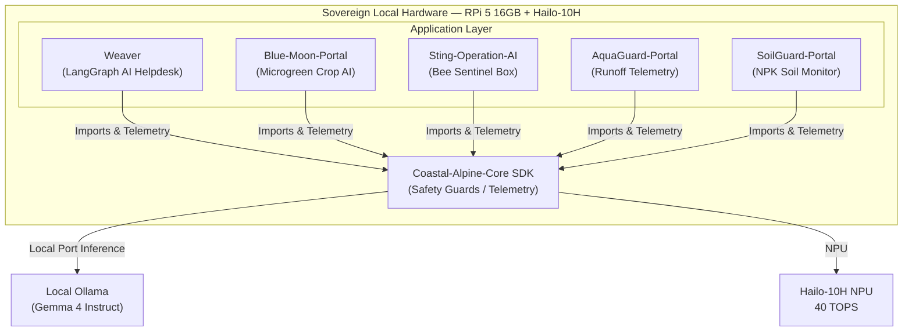

# Coastal Alpine Tech Limited: Kiwi Edge AI Stack

  
  
  
  
  
  

Welcome to the official repository landing page for **Coastal Alpine Tech Limited**, headquartered in New Plymouth, Taranaki, New Zealand. We design and deploy offline-native, data-sovereign edge intelligence systems for remote, high-stakes industrial, agricultural, and biosecurity settings across New Zealand.

Our stack operates entirely on-premise on the **canonical edge node** — **Raspberry Pi 5 (16GB)** with **Hailo-10H NPU** (40 TOPS AI Accelerator / AI HAT+ 2) — to maintain customary data rights (Te Mana Raraunga / Maori Data Sovereignty) and guarantee 100% operational uptime in rural catchments facing cloud blackouts.

---

## Canonical hardware target

| Component | Specification |
| :--- | :--- |
| Compute | **Raspberry Pi 5 — 16GB RAM** |
| NPU | **Hailo-10H** (40 TOPS) via Raspberry Pi **AI Accelerator / AI HAT+ 2** |
| OS | Raspberry Pi OS (64-bit) |
| Local LLM | Ollama + Gemma 4 (`gemma4:e4b`) on-device |

All Coastal Alpine edge repositories document this same target. Do not mix Hailo-8 / Hailo-10L / 8GB SKUs in product docs.

---

## The Kiwi Edge AI Stack Portfolio

| Repository | Role | Core NZ Regulations | Primary Hardware Target |
| :--- | :--- | :--- | :--- |
| [Weaver](https://github.com/fivepanelhat/Weaver) | Multi-tenant helpdesk & local RAG mesh | Privacy Act 2020, Public Records Act 2005 | RPi 5 16GB + Hailo-10H |
| [Blue-Moon-Portal](https://github.com/fivepanelhat/Blue-Moon-Portal) | Multi-modal edge AI for microgreen cultivation (Byte Size Kai) | Biosecurity Act 1993, HSNO Act 1996, Food Act 2014 | RPi 5 16GB + Hailo-10H |
| [Sting-Operation-AI](https://github.com/fivepanelhat/Sting-Operation-AI) | YOLO wasp & bee classifier beehive sentinel | Biosecurity Act 1993, Animal Welfare Act 1999 | RPi 5 16GB + Hailo-10H |
| [AquaGuard-Portal](https://github.com/fivepanelhat/AquaGuard-Portal) | Water runoff, sediment, & turbidity telemetry | RMA 1991, Horizons One Plan, regional consents | RPi 5 16GB + Hailo-10H |
| [SoilGuard-Portal](https://github.com/fivepanelhat/SoilGuard-Portal) | Soil N-P-K, pH, & moisture crop control | NES-F 2020 (Synthetic N cap), FWFPs | RPi 5 16GB + Hailo-10H |
| [Coastal-Alpine-Core](https://github.com/fivepanelhat/Coastal-Alpine-Core) | Shared SDK (offline LLM wrapper, safety, telemetry) | — | RPi 5 16GB + Hailo-10H |
| [coastal-alpine-stack](https://github.com/fivepanelhat/coastal-alpine-stack) | Full stack compose / K3s edge runtime | — | RPi 5 16GB + Hailo-10H |
| [Sovereign-Edge-Firmware](https://github.com/fivepanelhat/Sovereign-Edge-Firmware) | ESP32 sensor firmware + edge hub | — | RPi 5 16GB hub + ESP32 nodes |
| [Aether](https://github.com/fivepanelhat/Aether) | Sovereign agentic development orchestrator | — | Dev workstation / edge companion |

---

## Stack Architecture Overview

The following diagram illustrates how the shared core SDK powers data-sovereign telemetry parsing, security screening, and offline reasoning across the different application portals:

---

## Core Operating Philosophies

1. **Sovereign by Design**: Data generated on NZ *whenua* is processed and stored locally, fully conforming to Te Mana Raraunga principles. We avoid commercial third-party cloud data leakage.
2. **Rural Resilience**: Our systems are engineered to withstand rural connectivity blackouts, executing local multi-modal vision and audio inference without any internet connection.
3. **Regulatory Safety**: Systems actively control actuators (like locking out fertigation lines or disabling class 3B lasers) to automatically prevent regulatory breaches of Regional Council rules.

Developed with pride in **Taranaki, New Zealand**.
