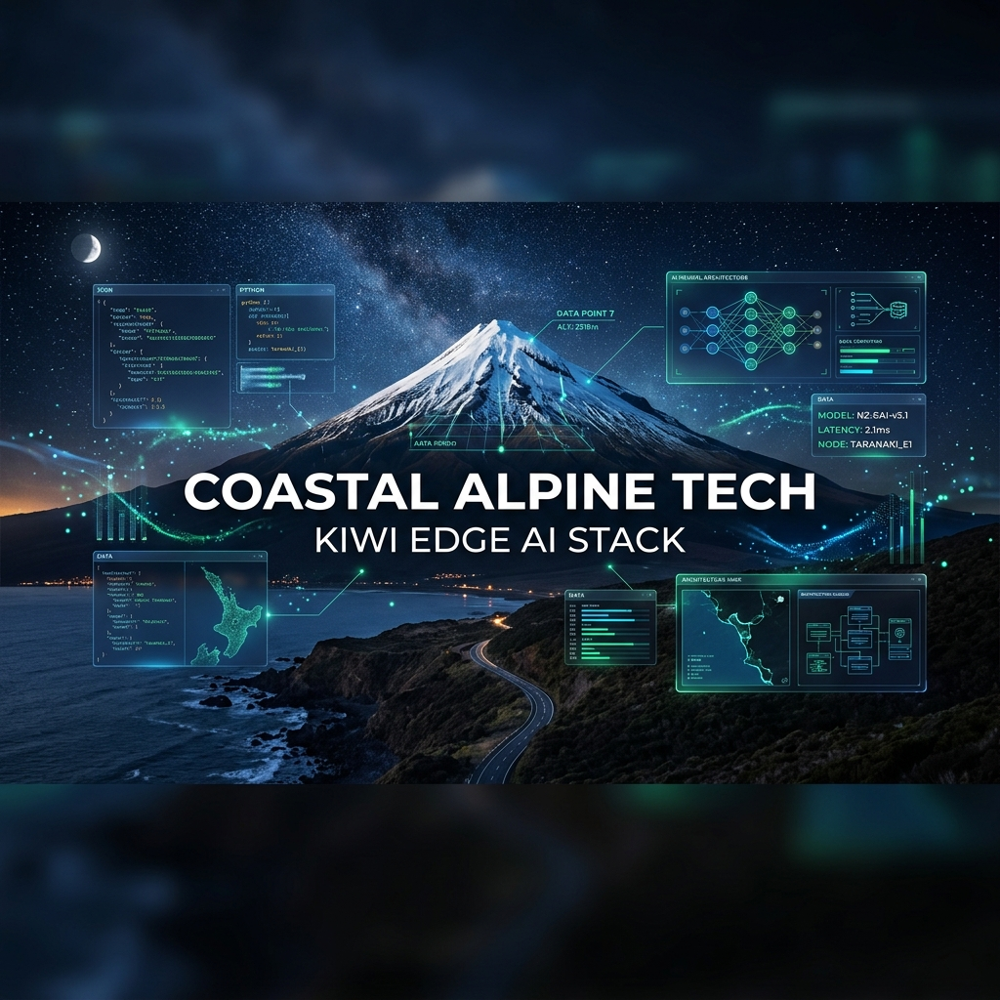

# Coastal Alpine Tech Limited: Kiwi Edge AI Stack

<!-- BEGIN CAT_CONGRUENCE_SNIPPET -->
## Coastal Alpine Tech portfolio

**Part of the [Kiwi Edge AI Stack](https://github.com/fivepanelhat/fivepanelhat)** | Founder OS: [NZ-Start-Up](https://github.com/fivepanelhat/NZ-Start-Up) | Agent policy: [`.github/agent-fleet/`](./.github/agent-fleet/)

> Sovereign hybrid edge AI for NZ farms and founders - local-first + multi-model, Te Mana Raraunga aligned - collaborating with Venture Taranaki, startups.com investors and Kotahitanga Investment Fund (HITL + cultural advisory for formal approaches).

**See [AI Infrastructure Leadership](./AI_INFRASTRUCTURE_LEADERSHIP.md) for our positioning as New Zealand's leader in sovereign edge AI Infrastructure.**

**Agents inform, draft, prepare, monitor, and remind. Humans advise, sign, file, send, and pay.** 
Anti-hallucination policy: [`.github/agent-fleet/anti-hallucination.md`](./.github/agent-fleet/anti-hallucination.md) | Congruence: [`CAT_CONGRUENCE.md`](./CAT_CONGRUENCE.md)
<!-- END CAT_CONGRUENCE_SNIPPET -->

## Company Updates

**Latest (24 August 2026):** NZ Startup in a Box + Byte Size Kai skill fleets completed.

| Update | Key links |
|--------|-----------|
| **NZ Startup in a Box** — full founder digital-employee fleet (legal, finance, compliance, content, angels, people, IP, discovery, risk) | [NZ-Start-Up](https://github.com/fivepanelhat/NZ-Start-Up) |
| **Byte Size Kai** — live farm/community kai operational skills (orchestrator, pilot partnership, node commissioning, insight synthesis, consent & sovereignty) | [Byte-Size-Kai](https://github.com/fivepanelhat/Byte-Size-Kai) |
| **Full chronological company updates** (with hyperlinks for clients & founder) | **[docs/UPDATES.md](./docs/UPDATES.md)** |

Earlier major milestones (July 2026): AI Infrastructure Leadership, Commercial Positioning, Enterprise Readiness artefacts, Funding system scaffold, Hybrid foundation + dual-platform installers. See the full list in [docs/UPDATES.md](./docs/UPDATES.md).

<!-- BEGIN PRIVACY_SECURITY_GOVERNANCE -->
## Privacy / Security / Governance

Coastal Alpine Tech products treat operational and personal data as **taonga**. Defaults favour **local-first** operation, **purpose-limited** collection, and **Human-in-the-Loop** for high-stakes actions.

### Hard commitments

| Commitment | Statement |
| :--- | :--- |
| **No data sales** | **We do not sell personal information or customer operational data to third parties** for advertising, brokerage, or unrelated commercial exploitation. |
| **NZ Privacy Act 2020** | Collection, use, storage, and disclosure of personal information is designed to operate in accordance with the **Privacy Act 2020** information privacy principles (including IPP awareness and IPP 3A indirect-collection notification where applicable). |
| **Te Mana Raraunga** | Where Māori data or community data interests arise, systems are designed to operate **in accordance with Te Mana Raraunga** principles (including Rangatiratanga, Whakapapa, Whanaungatanga, Kotahitanga, Manaakitanga, Kaitiakitanga) as a sovereignty and stewardship lens — not as a marketing slogan. |
| **NZ AI safety** | AI features follow a **NZ AI safety-aligned** posture: Algorithm Charter spirit (fairness, transparency, human oversight where relevant), digital.govt.nz / responsible AI guidance awareness, no silent model training on private journals without consent, and HITL for high-stakes outcomes. |
| **Security** | No silent exfiltration; owner-controlled credentials; least privilege; SecOps / dependency hygiene on the fleet cadence. |
| **Governance** | Agents **inform, draft, prepare**; humans **advise, sign, file, send, and pay**. |

| Pillar | Commitment |
| :--- | :--- |
| **Privacy** | Local-first / offline-capable where practical; Privacy Act 2020; Te Mana Raraunga spirit; third-party AI only when **opt-in and labelled** |
| **Security** | No silent exfil of tenant or personal data; owner-controlled keys |
| **Governance** | HITL for high-stakes; Te Mana Raraunga spirit; multi-region compliance maps in [`COMPLIANCE_REGIONS.md`](./COMPLIANCE_REGIONS.md) |

**Agents inform, draft, prepare, monitor, and remind. Humans advise, sign, file, send, and pay.**

Fleet policy: [fivepanelhat / Kiwi Edge AI Stack](https://github.com/fivepanelhat/fivepanelhat) · [`COMPLIANCE.md`](./COMPLIANCE.md) · [`COMPLIANCE_REGIONS.md`](./COMPLIANCE_REGIONS.md) · [`SECURITY.md`](./SECURITY.md)
<!-- END PRIVACY_SECURITY_GOVERNANCE -->

## Fleet mandate: Privacy / Security / Governance

Every Coastal Alpine Tech repository is expected to surface **Privacy**, **Security**, and **Governance** in the README and `COMPLIANCE.md` / `SECURITY.md`:

1. **Privacy** — local-first defaults, Privacy Act 2020 awareness, Te Mana Raraunga spirit, opt-in labelled third-party AI
2. **Security** — no silent exfiltration, least privilege, SecOps / red-team cadence on fleet CI
3. **Governance** — HITL for high-stakes; agents draft/prepare only; humans sign, send, file, and pay

<!-- BEGIN PROBLEMS_SOLUTIONS_ECONOMY -->
## Problems we are solving

The **Kiwi Edge AI Stack** exists so Aotearoa can run hybrid edge + multi-model AI for farms, founders, and frontline care **without** defaulting to always-on foreign cloud dependency.

1. **Primary industries locked to cloud SaaS** - Rural latency, outages, and offshore data residency conflict with real operations and Te Mana Raraunga.
2. **Fragmented product landscape** - Growers, EDAs, and whanau face many disconnected tools instead of one coherent stack.
3. **Founder overhead** - Early NZ companies burn time on formation, compliance, and grants with little local digital capacity.
4. **Social navigation fatigue** - Whānau in high-stress pathways face scattered directories and equity gaps.
5. **Shallow "AI employees" hype** - Unconstrained agents create legal and cultural risk; NZ needs hard HITL ceilings.

## Solution we have built

| Layer | Solution (repo) | Role |
| :--- | :--- | :--- |
| **Beachhead agritech** | [Byte Size Kai](https://github.com/fivepanelhat/Byte-Size-Kai) | Lead commercial edge product for crop / Mana Kai intelligence |
| **Beachhead social** | [Front_Line_Whanau](https://github.com/fivepanelhat/Front_Line_Whanau) | National whānau / frontline support platform |
| **Founder OS** | [NZ-Start-Up](https://github.com/fivepanelhat/NZ-Start-Up) | Local founder OS + EDA white-label kit |
| **Edge foundation** | Core, Weaver, Aether, stack, firmware | SDK, orchestration, companion agents, deploy, field nodes |
| **Domain portals** | SoilGuard, AquaGuard, Sting | Soil, water, biosecurity specialists |
| **Privacy utility** | CAT-mail | Privacy-first email assist (parked vs beachheads) |

**Hardware target:** Raspberry Pi 5 (16GB) + Hailo-10H NPU | **Policy:** agents draft/prepare; humans sign/send/pay.

### Local (Taranaki) and national (Aotearoa) economic benefits

Coastal Alpine Tech is a **pre-seed** company engineering in **New Plymouth, Taranaki**, with field context in regional primary industries (including Mana Kai-class / Horowhenua agritech). Benefits are framed as **pathways**, not guaranteed job numbers.

#### Local / regional (Taranaki and rural NZ)

| Pathway | What it creates |
| :--- | :--- |
| **R&D and product HQ** | Engineering, product, and IP ownership in region - counterweight to capital-city-only tech |
| **Field install and support** | RPi / Hailo edge nodes, ESP32 sensors, and pilot support need local technicians and partners |
| **EDA leverage** | Tools that help Venture Taranaki-class programmes onboard more founders without linear staff growth |
| **Contractor network** | Legal, cultural advisory, hardware, and pilot ops spend that stays in NZ |

#### National economy and employment

| Pathway | What it creates |
| :--- | :--- |
| **Primary sector competitiveness** | Better yield, compliance, and biosecurity decisions support NZ's export food economy |
| **Onshore data value** | Farm, whānau, and SME operational data stays under NZ custody (Privacy Act + Te Mana Raraunga) |
| **Founder formation** | Faster, cleaner company setup and RDTI-ready logging keeps more early companies investable **in NZ** |
| **Digital capability outside main centres** | Edge AI skills (vision, MQTT, local LLM) transferable across regions |
| **Quality of work** | Human-in-the-loop design preserves skilled human roles in advice, compliance, and care |

#### How this product contributes

See **Solution we have built** above. Cross-portfolio map: [Kiwi Edge AI Stack](https://github.com/fivepanelhat/fivepanelhat) | employment detail: [NZ-Start-Up investor pack](https://github.com/fivepanelhat/NZ-Start-Up/blob/main/docs/INVESTOR_RD_AND_MARKET_REFERENCE.md).

#### Portfolio employment map (pathways)

| Path | Sequence | Employment / economy effect |
| :--- | :--- | :--- |
| **Founder -> fleet** | NZ-Start-Up -> RDTI logs -> board packs | More investable founders formed in Taranaki / regions |
| **EDA -> region** | PowerUp-class white-label -> cohort reports | EDA capacity without linear headcount |
| **Founder -> field** | Agritech founder -> Byte Size Kai / SoilGuard pilot | Farm productivity + local install jobs |
| **Trust -> enterprise** | HITL + compliance mapping -> procurement-ready narrative | Public / enterprise readiness without fake autonomy |
| **Social care** | Front_Line_Whanau (cultural HITL) | Social licence and equity impact (separate GTM from agritech pitch) |
<!-- END PROBLEMS_SOLUTIONS_ECONOMY -->

## Technical Moat

Coastal Alpine Tech’s defensibility comes from the tight integration of six capabilities that are rarely combined at the edge:

- **Edge orchestration** — LangGraph multi-tenant mesh (Weaver) that keeps every tenant’s knowledge and state strictly local.
- **Sovereign architecture** — Default-offline, Te Mana Raraunga-aligned paths. Data generated on whenua stays on whenua unless the owner explicitly moves it.
- **Hardware optimisation** — Canonical target of Raspberry Pi 5 16GB + Hailo-10H with energy-aware telemetry (joules, tokens/s) built into every portal path.
- **AI deployment tooling** — Shared Core SDK + dual-platform installers + Aether companion so the same stack runs on Windows/Linux workstations and production edge nodes.
- **Proprietary local datasets** — Continuous DataFlywheel that records trajectories, human feedback, and hardware outcomes on-device, then curates golden sets under owner control. Nothing leaves the node by default.
- **Inference optimisation** — Hardware-aware measurement and adaptive local paths (Ollama + optional Hailo acceleration) tuned for sub-10 W rural nodes rather than cloud GPUs.

These are not separate features. They form a single closed loop: sensors → local inference → trajectory capture → human-in-the-loop correction → improved local models → better decisions — all while remaining offline-capable and sovereignty-compliant.

The result is a system that becomes more valuable the longer it runs on a given farm or site, without requiring continuous cloud connectivity or data export.

## Enterprise Readiness

Coastal Alpine Tech is pre-seed. The following artefacts exist so that enterprise buyers, partners, and investors can see the design intent, current controls, and staged path forward — without over-claiming certification or maturity that does not yet exist.

| Artefact | Purpose |
|----------|---------|
| **[GOVERNANCE.md](./GOVERNANCE.md)** | Decision rights, HITL ceiling, roles, Cultural Advisory interface, escalation |
| **[Security & Compliance Roadmap](./.github/compliance/SECURITY_ROADMAP.md)** | Phased path: current state → first pilot → seed readiness |
| **[Threat Model](./.github/compliance/THREAT_MODEL.md)** | STRIDE-oriented view of the edge + multi-tenant + local-LLM attack surface |
| **[NZ AI Compliance + SOC 2 Framework](./.github/compliance/nz-ai-compliance-soc2/)** | Privacy Act, Te Mana Raraunga, SOC 2 control matrix, incident playbook, audit checklist |
| **Architecture diagrams** | Target architecture (Mermaid + images) in this README and in Core / Weaver / Aether / stack |

**Status (July 2026):** Working technical controls (SecurityGuard, DataFlywheel, tenant isolation design, SecOps workflows) + comprehensive design-target documentation. External audit and formal attestation are future phases gated on pilots and commercial traction.

## R&D Artefacts (2025)

Citation indexes acknowledging Coastal Alpine Tech research and development from organisational Drive materials. These are **design-intent / lineage documents**, not certifications or audited valuations. No personal data is published.

| Artefact | Period | Themes |
| --- | --- | --- |
| **[ARTEFACT-2025-08](./docs/artefacts/ARTEFACT-2025-08.md)** | August 2025 | AgriTech, MicrogreensDAO, Web3, **Sui**, RWA **tokenisation** |
| **[ARTEFACT-2025-11-12](./docs/artefacts/ARTEFACT-2025-11-12.md)** | Nov–Dec 2025 | V4 strategy, **Gold / Diamond / Platinum Edge**, **edge** compute (DGX Spark), multi-vertical blueprints |

Index: [`docs/artefacts/README.md`](./docs/artefacts/README.md)

**Fleet mirrors:** also published under `docs/artefacts/` in Core, stack, Aether, Weaver, Byte-Size-Kai, Front_Line_Whanau, scaffylads, and NZ-Start-Up.

## Commercial Positioning

Technology is currently ahead of commercial packaging. The commercial logic is documented so investors and partners can see customer segments, packaging shape, recurring revenue intent, GTM sequence, and sales funnel — without invented ARR or public dollar prices.

| Artefact | Purpose |
|----------|---------|
| **[Commercial Positioning](./.github/funding/COMMERCIAL_POSITIONING.md)** | Customer segments, packaging tiers (no public $), recurring model, GTM, funnel |
| **[Investor Matrix](./.github/funding/INVESTOR_MATRIX.md)** | What different capital types optimise for |
| **[Funding Eligibility Matrix](./.github/funding/FUNDING_ELIGIBILITY_MATRIX.md)** | Likelihood scores and gap-closure path |

**Pricing posture:** Specific dollar figures are not published. Commercial terms are set per pilot or partnership and refined with real willingness-to-pay data.

**Coastal Alpine Tech Limited** pre-seed startup, New Plymouth, Taranaki, Aotearoa New Zealand.

We are building offline-native, data-sovereign edge intelligence for remote industrial, agricultural, and biosecurity settings across Aotearoa. This org profile maps our **Kiwi Edge AI Stack** early-stage product architecture and open engineering work, **not** a claim of large-scale commercial deployment or raised Series capital.

Our stack is **hybridised** across **Coastal-Alpine-Core**, **Weaver**, **Aether**, and **coastal-alpine-stack**: develop on **Windows or Linux**; target production edge on the **canonical node** **Raspberry Pi 5 (16GB)** with **Hailo-10H NPU** (40 TOPS AI Accelerator / AI HAT+ 2) to support customary data rights (Te Mana Raraunga / Māori Data Sovereignty) and offline operation in rural catchments facing cloud blackouts.

---

## Compliance at a glance

A compact view of the governance work now living in this org profile (full framework under [`.github/compliance/`](.github/compliance/nz-ai-compliance-soc2/)):

 | Pillar | Focus |
 | :--- | :--- |
 | **Privacy Act 2020** | IPP mapping, DSAR pathways, retention |
 | **Te Mana Raraunga** | Māori data sovereignty + OCAP-aligned control |
 | **SOC 2 Type II** | CC / A / S / P controls, matrix |
 | **MBIE Responsible AI** | Safety-by-design, explainability, HITL gates |
 | **NZ Algorithm Charter** | Transparent decisions, human appeal |

**Status (pre-seed):** Compliance **framework documents** are in-repo as design targets **not** an external SOC 2 Type II attestation. Implementation is early-stage.
**Local docs:** [SKILL.md](.github/compliance/nz-ai-compliance-soc2/SKILL.md) | [Implementation guide](.github/compliance/nz-ai-compliance-soc2/README.md) | [Audit checklist](.github/compliance/nz-ai-compliance-soc2/references/COMPLIANCE_AUDIT_CHECKLIST.md) | [Security Roadmap](.github/compliance/SECURITY_ROADMAP.md) | [Threat Model](.github/compliance/THREAT_MODEL.md)

---

## Funding system (grants + tracker)

Org home for **Māori AI | deeptech | agritech | sovereign edge** funding discovery and applications (HITL required):

 | Resource | Path |
 | :--- | :--- |
 | **Funding index** | [`.github/funding/README.md`](.github/funding/README.md) |
 | **Guide** | [`.github/funding/FUNDING_GUIDE.md`](.github/funding/FUNDING_GUIDE.md) |
 | **Tracker** | [`.github/funding/FUNDING_TRACKER.md`](.github/funding/FUNDING_TRACKER.md) | [tracker.csv](.github/funding/tracker.csv) |
 | **Grants Agent skill** | [`.github/funding/grants-agent/SKILL.md`](.github/funding/grants-agent/SKILL.md) |
 | **Knowledge base** | [`.github/funding/knowledge-base/`](.github/funding/knowledge-base/) |
 | **Fit scorer** | `python .github/funding/scripts/score_fit.py --project "..."` |
 | **Eligibility matrix** | [`.github/funding/FUNDING_ELIGIBILITY_MATRIX.md`](.github/funding/FUNDING_ELIGIBILITY_MATRIX.md) |
 | **Investor matrix** | [`.github/funding/INVESTOR_MATRIX.md`](.github/funding/INVESTOR_MATRIX.md) |
 | **Commercial positioning** | [`.github/funding/COMMERCIAL_POSITIONING.md`](.github/funding/COMMERCIAL_POSITIONING.md) |
 | **Roadmap / todos** | [`.github/funding/ROADMAP_TIMELINE.md`](.github/funding/ROADMAP_TIMELINE.md) |
 | **Install matrix** | [`.github/funding/INSTALL_MATRIX.md`](.github/funding/INSTALL_MATRIX.md) |

### Open / near-term priorities (research snapshot 2026-07-13)

 | Priority | Fund | Status | Indicative value |
 | :--- | :--- | :--- | :--- |
 | **P0** | [New to R&D Grant](https://www.business.govt.nz/tax-and-money/innovation-funding/new-to-r-and-d-grant) (MBIE) | **OPEN** | 40% co-fund up to **$400k** |
 | **P0** | [Māori Development Fund](https://www.tpk.govt.nz/nga-putea-me-nga-ratonga/maori-development-fund) (TPK) | **OPEN** (rolling; regional office first) | Proposal-based |
 | **P0** | [Primary Sector Growth Fund](https://www.mpi.govt.nz/funding-rural-support/primary-sector-growth-fund) (MPI) | **OPEN** | Co-investment |
 | **P1** | R&D Experience Grant | Opens **13 Jul 2026** | Student ~10 weeks |
 | **P1** | R&D Career Grant | Opens **31 Aug 2026** | Up to $30k / $35k (6 months) |
 | **P1** | [RDTI](https://www.rdti.govt.nz/) | Ongoing | **15%** tax credit |
 | **P2** | NZIAT AI Research Platform | Partner / watch | ~**$70m** / 7 years (platform) |

Re-verify every status on the funder site before applying. Agent drafts are **not** submissions.

---

## Canonical hardware target

 | Component | Specification |
 | :--- | :--- |
 | Compute | **Raspberry Pi 5 16GB RAM** |
 | NPU | **Hailo-10H** (40 TOPS) via Raspberry Pi **AI Accelerator / AI HAT+ 2** |
 | OS (edge) | Raspberry Pi OS (64-bit) |
 | Dev hosts | **Windows 10/11** | **Linux** (Ubuntu/Debian/RPi OS) | macOS optional |
 | Local LLM | Ollama + Gemma 4 (`gemma4:e4b`) on-device |

All Coastal Alpine edge repositories document this same target. Do not mix Hailo-8 / Hailo-10L / 8GB SKUs in product docs.

---

## Focus wedges (90-day)

| Priority | Wedge | Canonical repo | Notes |
| :--- | :--- | :--- | :--- |
| **P0** | **Byte Size Kai** (agritech) | [Byte-Size-Kai](https://github.com/fivepanelhat/Byte-Size-Kai) + Core | Commercial hardware pilot path |
| **P0** | **Front Line Whānau** (social) | [Front_Line_Whanau](https://github.com/fivepanelhat/Front_Line_Whanau) | Live: front-line-whanau.vercel.app |
| Supporting | Stack foundation | Core, Weaver, Aether, stack, firmware | Shared SDK / deploy |
| Supporting | Sister portals | Soil / Aqua / Sting | Background until wedge needs them |
| Parked | Founder tools | CAT-mail, NZ-Start-Up | Supporting capacity |
| **Archived** | Whānau hub scaffold | [whanau-preterm-support-hub](https://github.com/fivepanelhat/whanau-preterm-support-hub) | **Merged into Front_Line_Whanau** (2026-07-16) |

## License matrix (SPDX)

| Repository | License | Notes |
| :--- | :--- | :--- |
| Coastal-Alpine-Core, Weaver, coastal-alpine-stack, portals, firmware | Proprietary (CAT) | Commercial edge stack |
| Byte-Size-Kai | Proprietary (CAT) | Lead agritech product |
| Front_Line_Whanau | Proprietary (CAT) | National social platform |
| Aether | Proprietary (CAT) | Internal companion |
| scaffylads | Proprietary (CAT) | Scaffolding work journal |
| CAT-mail | Proprietary (CAT) | Privacy-first email agent |
| NZ-Start-Up | Proprietary (CAT) | Founder OS (dual-licence, Track A default) |
| fivepanelhat (profile) | Proprietary docs | Portfolio landing |

The entire portfolio is standardised on the **Coastal Alpine Tech proprietary licence**.

## The Kiwi Edge AI Stack Portfolio

See the full repository table and architecture diagrams further below, or jump to the featured products:

- **[Byte Size Kai](https://github.com/fivepanelhat/Byte-Size-Kai)** — Lead agritech product
- **[Front_Line_Whanau](https://github.com/fivepanelhat/Front_Line_Whanau)** — National whānau / frontline support platform
- **[NZ-Start-Up](https://github.com/fivepanelhat/NZ-Start-Up)** — Founder OS + EDA white-label kit
- **[Coastal-Alpine-Core](https://github.com/fivepanelhat/Coastal-Alpine-Core)** | **[Weaver](https://github.com/fivepanelhat/Weaver)** | **[Aether](https://github.com/fivepanelhat/Aether)** | **[coastal-alpine-stack](https://github.com/fivepanelhat/coastal-alpine-stack)** — Foundation layer

---

## Recent stack updates

**Full chronological list with hyperlinks:** **[docs/UPDATES.md](./docs/UPDATES.md)**

### 24 August 2026 — NZ Startup in a Box + Byte Size Kai skill fleets completed

| Area | What shipped |
| :--- | :--- |
| **NZ Startup in a Box** | Full digital-employee fleet: legal-document-assistant, finance-clerk, compliance-registrar, content-comms-officer, nz-angel-networks, people-ops-officer, ip-protection-officer, customer-discovery-synthesis, risk-insurance-advisor |
| **Byte Size Kai** | Operational skills: byte-size-kai-orchestrator, kai-pilot-partnership, farm-node-commissioning, community-insight-synthesis, mana-kai-consent-and-sovereignty |
| **Company Updates page** | New [docs/UPDATES.md](./docs/UPDATES.md) for clients and founder |

### Earlier July 2026 milestones

See [docs/UPDATES.md](./docs/UPDATES.md) for AI Infrastructure Leadership, Commercial Positioning, Enterprise Readiness, Funding system scaffold, and Hybrid foundation + dual-platform installers.

---

*Coastal Alpine Tech — Sovereign Edge AI for Aotearoa New Zealand*
