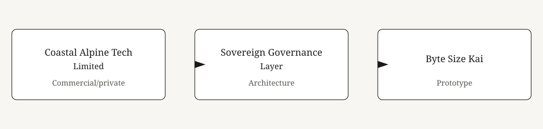
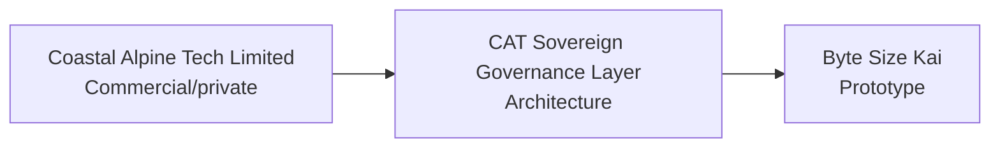

# Architecture

**Updated:** 4 October 2026
**Stage:** Pre-seed. One company. One governance layer. One public prototype.
**Rule:** A box label is a maturity label, not a certification. Nothing here is Production or Pilot.

Other names are aliases, not extra products.

| Name | What it is |
| --- | --- |
| Coastal Alpine Tech Limited | The company. |
| CAT Sovereign Governance Layer | The layer. Architecture only. |
| Byte Size Kai | The public prototype. Simulated twin. No named pilot. |
| Safe NZ AI | Operating description of the company. Not a badge. |
| Sprintit, MintIT | Commercial entry names for the same layer. Methods and prices stay private. |
| Kiwi Edge | Stack posture. Not a separate product and not a bill of materials. |
| Founder OS | Internal portfolio map. Not a public product. |

## Diagram

Humans decide. Agents draft. No device reading is stored. No customer deployment is claimed.

Reproduce the labels from [COMPONENT_STATUS.md](../../COMPONENT_STATUS.md).
